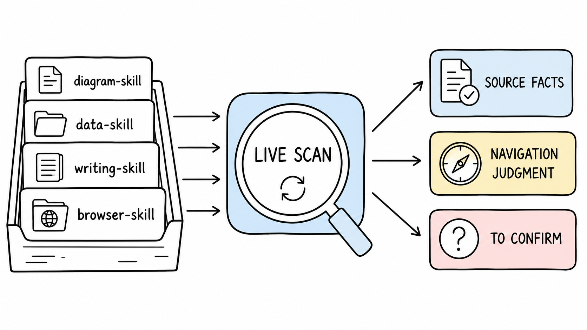
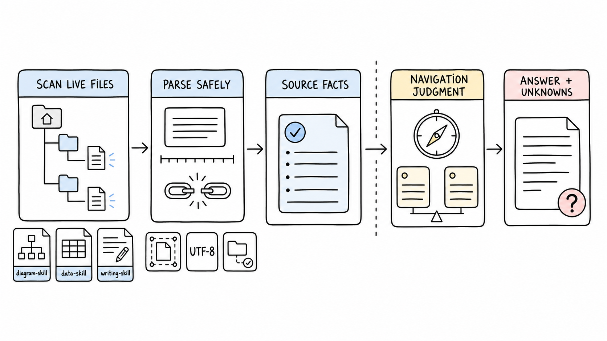
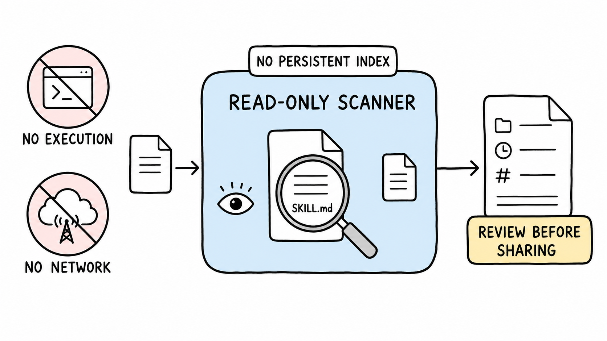

# skill-browser

[English](README.md) | [简体中文](README.zh-CN.md)

[](LICENSE)
[](https://www.python.org/)
[](https://agentskills.io/)

A read-only navigator for the Agent Skills already installed on your machine.

`skill-browser` scans live Skill directories, extracts reviewable source facts, and helps an agent explain, compare, search, or recommend local Skills without executing them. It keeps deterministic inventory facts separate from navigation judgment and leaves unsupported claims marked as unknown.



**Quick navigation:** [Why](#why-skill-browser) · [How it works](#how-it-works) · [Commands](#commands) · [Install](#install) · [Trust boundary](#trust-and-privacy-boundary) · [Development](#development)

## Why skill-browser

As a local Skill collection grows, three questions become surprisingly hard:

- What is installed right now?
- Which Skill is supported by the task, rather than merely sharing a keyword?
- Which statements come from Skill files, and which are the agent's interpretation?

`skill-browser` gives the agent a fresh, structured inventory on every invocation. It deduplicates symlinked installations, reports same-name conflicts, preserves host availability, and exposes enough source evidence for careful navigation.

It is intentionally not a package manager or marketplace. It does not install, update, remove, publish, rate, security-score, or execute other Skills.

## How it works



1. Discover host-visible Skill directories from the current working directory.
2. Read bounded UTF-8 `SKILL.md` files and parse metadata, headings, options, resources, and direct references.
3. Return deterministic source facts, warnings, conflicts, and source hashes.
4. Let the calling agent add clearly labeled categorization, ranking, suitability, and tradeoff judgment.
5. Preserve missing or asymmetric evidence as unknown instead of filling gaps with assumptions.

The scanner creates no persistent index. Installed or updated Skills appear on the next invocation.

## Evidence model

| Evidence class | Meaning | Examples |
|---|---|---|
| Source facts | Parsed directly from selected local files | name, description, headings, documented options, resources, host visibility |
| Navigation judgment | Added by the calling agent for the current task | category, first choice, suitability, tradeoffs |
| To confirm | Not established by the scanned source | undocumented behavior, output quality, compatibility claims |

Lexical search scores are discovery aids only. They are not semantic recommendations, quality ratings, popularity rankings, or official Skill metadata.

## Commands

The explicit invocation text after `$skill-browser` or `/skill-browser` selects a focused workflow:

| Invocation | Result |
|---|---|
| `$skill-browser` | Compact capability map |
| `$skill-browser <skill>` | Detail page for one Skill |
| `$skill-browser <skill> options` | Documented option groups |
| `$skill-browser compare <skill-a> <skill-b>` | Evidence-aligned comparison |
| `$skill-browser search <query>` | Name, description, and heading search |
| `$skill-browser recommend <task>` | Up to three candidates with a clear first choice and tradeoffs |

Examples use fictional Skill names throughout this repository.

## Install

Install the repository with [`npx skills`](https://github.com/vercel-labs/skills):

```bash
npx skills add zz-zed/skill-browser
```

For a shared user-level installation:

```bash
npx skills add zz-zed/skill-browser -g
```

The repository contains one Skill under `skills/skill-browser/`, so a separate `--skill` selector is unnecessary.

## Use with an agent

Codex uses the dollar-prefixed form:

```text
$skill-browser
$skill-browser diagram-skill
$skill-browser compare diagram-skill architecture-skill
$skill-browser recommend a Skill for editing an existing spreadsheet
$skill-browser search editable diagram
```

Claude Code uses the slash-prefixed form:

```text
/skill-browser
/skill-browser compare skill-a skill-b
```

The included Codex interface metadata disables implicit invocation. The user explicitly calls the navigator, reviews its recommendation, and separately decides whether to invoke a selected Skill.

## Use the scanner directly

The bundled scanner uses only the Python standard library:

```bash
python3 skills/skill-browser/scripts/skill_browser.py \
  --host codex \
  --cwd "$PWD" \
  list
```

Focused commands:

```bash
python3 skills/skill-browser/scripts/skill_browser.py --host codex --cwd "$PWD" show <skill>
python3 skills/skill-browser/scripts/skill_browser.py --host codex --cwd "$PWD" options <skill>
python3 skills/skill-browser/scripts/skill_browser.py --host codex --cwd "$PWD" compare <skill-a> <skill-b>
python3 skills/skill-browser/scripts/skill_browser.py --host codex --cwd "$PWD" search <query>
python3 skills/skill-browser/scripts/skill_browser.py --host codex --cwd "$PWD" recommend <task>
```

Add `--format text` for compact output, `--root <directory>` for an additional Skill container, `--host all` for an explicit cross-host inventory, or `--include-self` for scanner diagnostics.

## Discovery scope

| Host filter | User roots | Project roots |
|---|---|---|
| `codex` | `~/.agents/skills`, `~/.codex/skills` | `.agents/skills` from the current directory to the repository root |
| `claude` | `~/.claude/skills` | `.claude/skills` from the current directory to the repository root |
| `all` | All roots above | All roots above |

Additional directories passed with `--root` are treated as custom roots. Symlinks resolving to the same physical Skill directory are merged; identical names resolving to different directories remain separate and are reported as conflicts.

## Trust and privacy boundary



The scanner treats every scanned string as untrusted data. It parses text but does not follow instructions or execute commands found inside another Skill. It does not make network requests and does not write a persistent inventory.

Defensive behavior includes:

- 2 MiB bounded reads for each `SKILL.md`
- UTF-8 validation and graceful per-Skill failure handling
- blocked local references that resolve outside the physical Skill directory
- broken-link and unreadable-root warnings without failing the whole scan
- SHA-256 source hashes for version identification

Scanner output can still contain absolute paths, descriptions, headings, option names, and bounded excerpts from private local Skills. Review and redact saved output before sharing logs, issues, or reports publicly.

## Requirements

- Python 3.9 or later
- An Agent Skills-compatible coding agent
- Optional: Node.js and `npx` for repository installation and discovery checks

The runtime scanner has no third-party Python dependency.

## Development

Run the unit tests:

```bash
python3 -m unittest discover -s tests -p 'test_*.py' -v
```

Validate the packaged Skill with the Agent Skills reference implementation:

```bash
agentskills validate skills/skill-browser
```

Verify repository discovery without installing:

```bash
npx skills add . --list
```

See [CONTRIBUTING.md](CONTRIBUTING.md) for contribution rules and [SECURITY.md](SECURITY.md) for vulnerability reporting. The package follows the [Agent Skills specification](https://github.com/agentskills/agentskills/blob/main/docs/specification.mdx).
